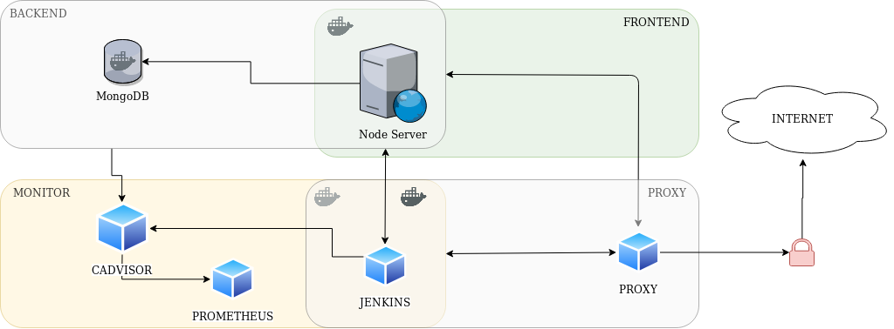
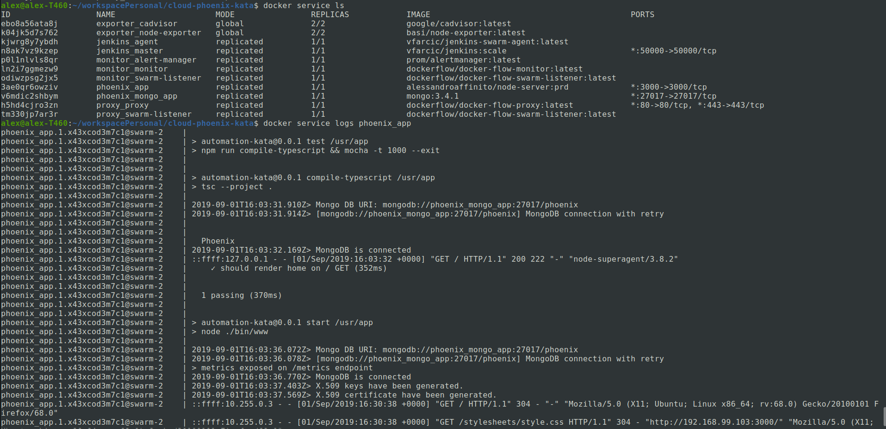
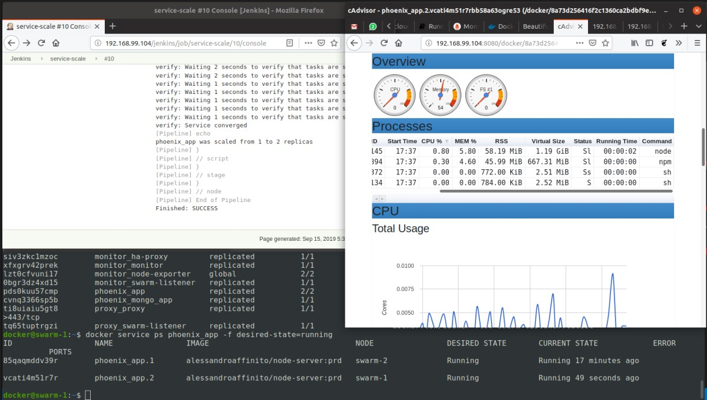

# README
Hi,  
in the setup folder there is a `setup.sh` script where I tried to reproduce and describe all the steps needed to recreate the architecture, adding also commands in case your system is already configured (e.g.: Virtualbox machines already created).

So after the setup you should be able to connect on `$(docker-machine ip swarm-$i):3000`

### Assumptions
In order to save time I had to mock-up some functionalities or patterns, so you will find some configuration 
containing hard-coded values or work-around listed below as WIP paragraphs.

I suggest to run the commands step by step instead of launching the script since some of them could heavily change your environment configuration.
Once the cluster is up I've written `./setup/node-stack-rebuild.sh` to fast redeploy changes from the node app to the stack.

---
The Docker Flow Monitor image provide a way to reconfigure Prometheus every time a new service is deployed. It uses Prometheus as a metrics storage and query engine.

**WIP**: Monitoring stack to collect metrics through a Prometheus service which will also generate notifications in case of high resource.
This will also be hooked to a Jenkins job (*service-scale*) to enable auto-scaling.  
Other notifications will be redirected on a [Slack channel](https://phoenix-bgc3988.slack.com/) I made for this project.  
The Prometheus node interface leverage on the [prom-client](https://github.com/siimon/prom-client) project.
I also made an API (`/scale/:instances`) to manage autoscaling from the application tier in order to have
a temporary work-around, but it seems to fail due to sibling docker problems related to the shared volume.

After the Node.js Docker is deployed an integration test is automatically done (npm test).

**TODO**: Jenkins job triggered by GIT push to rebuild server image, push it on Docker Hub and deploy it again on the virtual machines.

## Reliability
- Added re-triable connectivity to database
- Automated restart of nodes through Swarm
- Cron jobs to backup DB data from running containers (setup-docker-machine.sh)
- *TODO*: chaos monkey  
https://www.gremlin.com/chaos-monkey/chaos-monkey-alternatives/docker/

## Performance
- Certificate generation is made at server start-up and stored on file-system

## Security
- Fixed Node dependencies security issues

## Automation
- Automated initial setup through docker-composer and Swarm
- Script to build and redeploy the app after some modification (`./setup/node-stack-rebuild.sh`)
    *TODO*: idempotent.
- Integration tests are run from the multistage Docker file `config/stack/node-multistage.dockerfile` immediately after the testing build
- Backups: inside the VM machine configuration `setup/setup-docker-machine.sh` there will be two cron jobs setup to backup Mongo DB data and all the container logs younger than *$MIN_BKP_RETENTION* days
- Jenkins CI/CD: on first start you have to update Jenkins autoscale pipeline with the script provided in `service-scale.groovy`
- TODO: Unit tests

## Monitoring
- WIP: A monitoring stack is provided where Prometheus is in charge of collecting metrics from the cluster, this should then be used to call a Jenkins job (service-scale) to scale up or down the web app in case some given condition is met.

----
The architecture design (to-be):  

An overview of the architecture up & running (as-is):  

After Jenkins auto-scale service had run you can check the services with `docker service ps phoenix_app -f desired-state=running`

